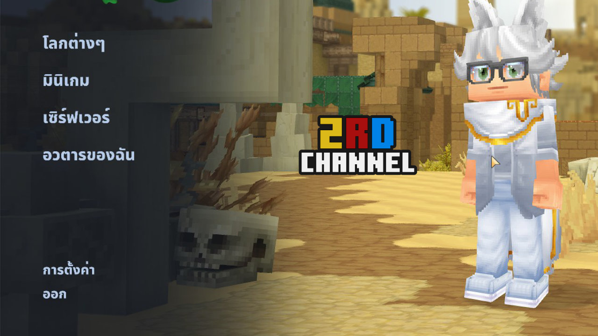

# Hytale Font Fix
ใช้แก้ฟอนต์ของเกม Hytale

## วิธีการใช้งาน | How to use
TH: ให้ลากไฟล์ .ttf เข้าไปใส่ที่ generate_font.bat ได้เลย เมื่อเสร็จแล้วไฟล์ .png และ .json จะอยู่ในโฟลเดอร์ font_fix

EN: Just drag the .ttf file into generate_font.bat. Once finished, the .png and .json files will be in the font_fix folder.

This repository relies on the following repositories:  
[Chlumsky's msdf-atlas-gen](https://github.com/Chlumsky/msdf-atlas-gen)
